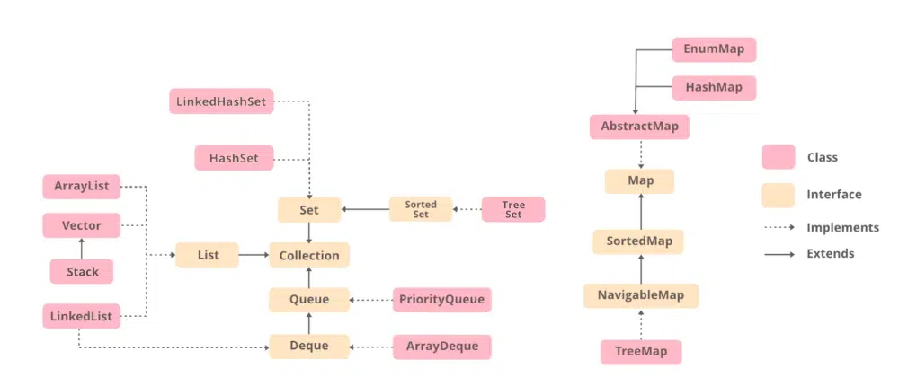

```
1. ArrayList
ArrayList is a class implemented using a list interface, in that provides the functionality of a dynamic array where the size of the array is not fixed.

Syntax:

ArrayList<_type_> var_name = new ArrayList<_type_>();
2. Vector
Vector is a Part of the collection class that implements a dynamic array that can grow or shrink its size as required.

Syntax:

public class Vector<E> extends AbstractList<E> implements List<E>, RandomAccess, 
Cloneable, Serializable
3. Stack
Stack is a part of Java collection class that models and implements a Stack data structure. It is based on the basic principle of last-in-first-out(LIFO) .

Syntax:

public class Stack<E> extends Vector<E>
4. LinkedList
LinkedList class is an implementation of the LinkedList data structure. It can store the elements that are not stored in contiguous locations and every element is a separate object with a different data part and different address part.

Syntax:

LinkedList name = new LinkedList();  
5. HashSet
HashSet is implemented using the Hashtable data structure. It offers constant time performance for the performing operations like add, remove, contains, and size.

Syntax:

public class HashSet<E> extends AbstractSet<E> implements Set<E>, Cloneable, Serializable
6. LinkedHashSet
LinkedHashSet is an ordered version of HashSet that maintains a doubly-linked List across all elements.

Syntax:

public class LinkedHashSet<E> extends HashSet<E> implements Set<E>, Cloneable, Serializable
7. TreeSet
TreeSet class is implementations of the SortedSet interface in Java that uses a Tree for storage. The ordering of the elements is maintained by a set using their natural ordering whether an explicit comparator is provided or not. 

Syntax:

TreeSet t = new TreeSet(Collection col);
8. PriorityQueue
The PriorityQueue is based on the priority heap. The elements of the priority queue are ordered according to the natural ordering, or by a Comparator provided at queue construction time, depending on which constructor is used. 

Syntax:

public class PriorityQueue<E> extends AbstractQueue<E> implements Serializable
9. ArrayDeque
The ArrayDeque class in Java is an implementation of the Deque interface that uses a resizable array to store its elements. The ArrayDeque class provides constant-time performance for inserting and removing elements from both ends.

Syntax:

public class ArrayDeque<E> extends 
AbstractCollection<E> implements Deque<E>, Cloneable,Serializable
10. HashMap
HashMap Class is similar to HashTable but the data unsynchronized. It stores the data in (Key, Value) pairs, and you can access them by an index of another type.

Syntax:

public class HashMap<K,V> extends AbstractMap<K,V>
implements Map<K,V>, Cloneable, Serializable
11. EnumMap
EnumMap extends AbstractMap and implements the Map interface in Java.

Syntax:

public class EnumMap<K extends Enum<K>,V> extends 
AbstractMap<K,V> implements Serializable, Cloneable
12. AbstractMap
The AbstractMap class is a part of the Java Collection Framework. It implements the Map interface to provide a structure to it, by doing so it makes the further implementations easier.

Syntax:

public abstract class AbstractMap<K,V> extends Object, implements Map<K,V>
13. TreeMap
A TreeMap is implemented using a Red-Black tree.TreeMap provides an ordered collection of key-value pairs, where the keys are ordered based on their natural order or a custom Comparator passed to the constructor.

SortedMap m = Collections.synchronizedSortedMap(new TreeMap(...)); 
```
